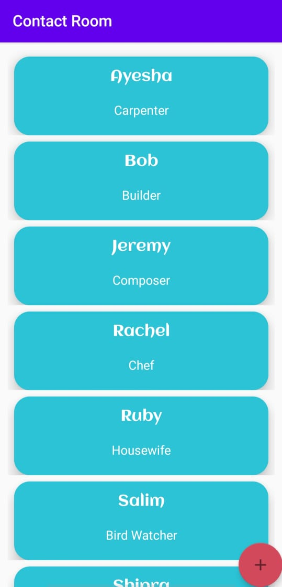
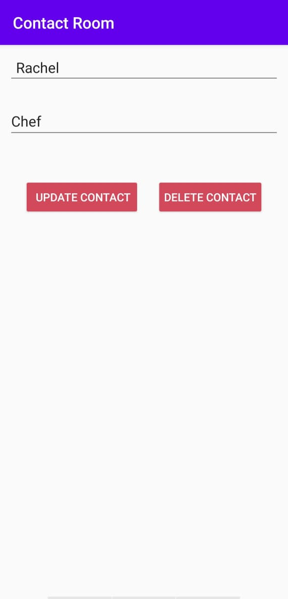
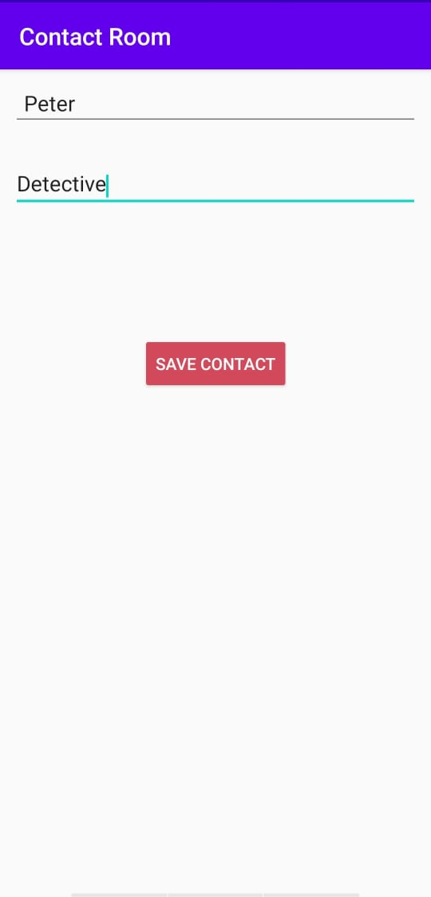

# ContactRoom

This app is a Contact Manager app.
It has the following features:
- Add a person's name and occupation
- Update the name and occupation
- Delete the person's infomation
- View all the contacts and their information

The app uses:
- RecyclerView and ArrayAdapter to display contacts efficiently
- Android Room persistence library to access SQLite database fluently

   

